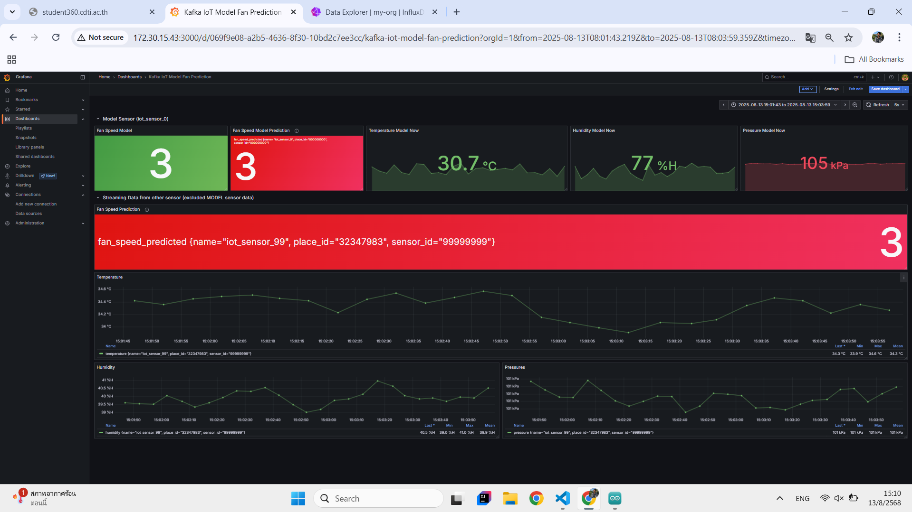

# Online Prediction
เป็นระบบ Online Machine Learning Prediction ที่รับข้อมูลจาก IoT sensor แบบต่อเนื่อง → ทำนายผลด้วยโมเดล → ส่งต่อไปให้ระบบอื่นใช้ และเก็บในฐานข้อมูลเชิงเวลา พร้อมอัปเดตโมเดลเรื่อยๆ
<!-- Online Prection ทำงานอย่างไร  -->

## ปิดการใช้งานของ Batch ML ดังนี้

1. Kafka-to-Jsonl
2. Train-from-data
3. Predict-then-influxdb

## เริ่มใช้งาน Online ML ดังนี้

1. docker compose down batch ML
2. เเก้ไฟล์ .env ใน Online-ML-Predict
3. docker compose up Online-ML-Predict

## ผลที่ได้จากการใช้ ML มีดังนี้

<!-- แนบรูป Grafana  พร้อมอธิบาย -->
